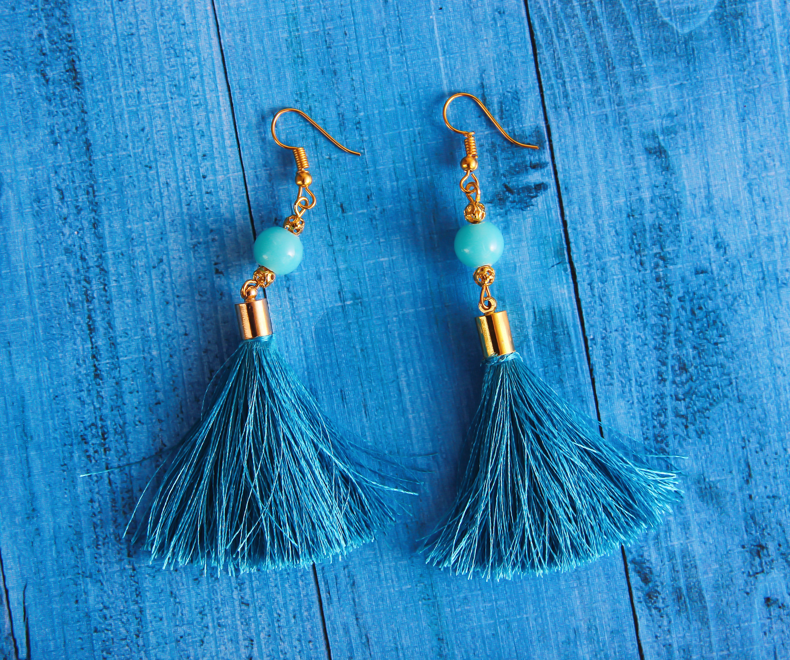
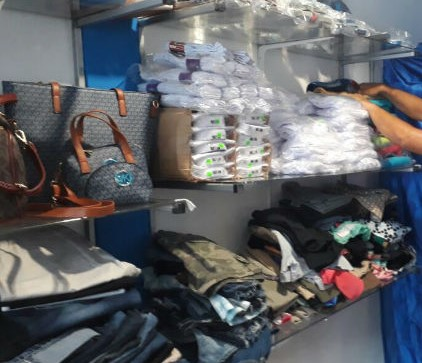
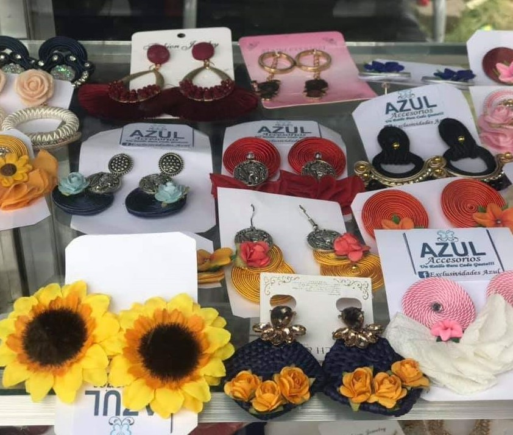
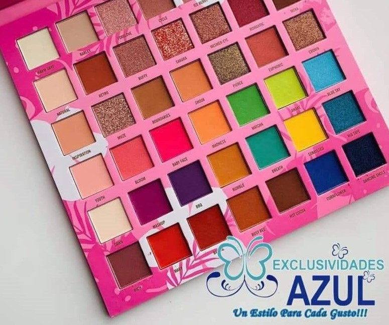
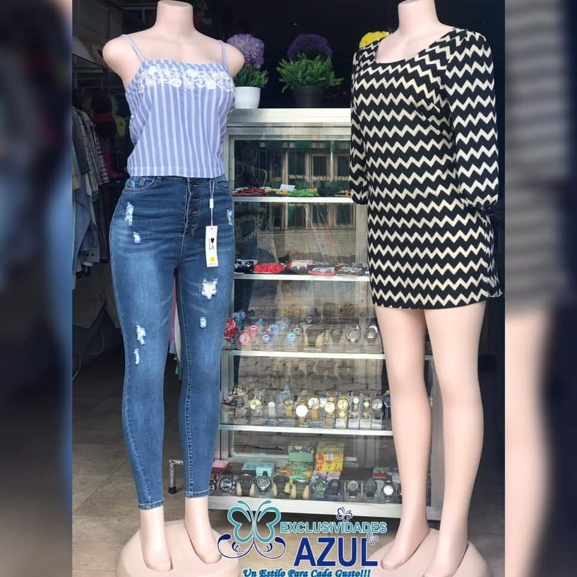
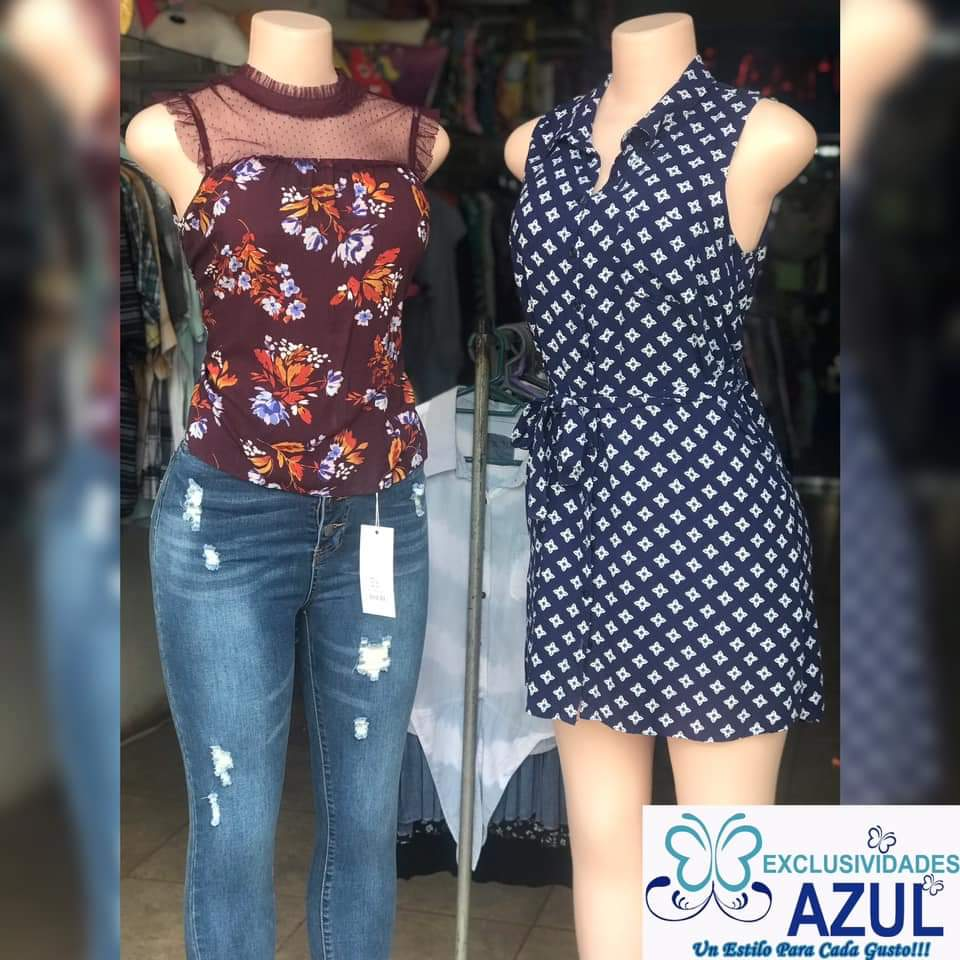
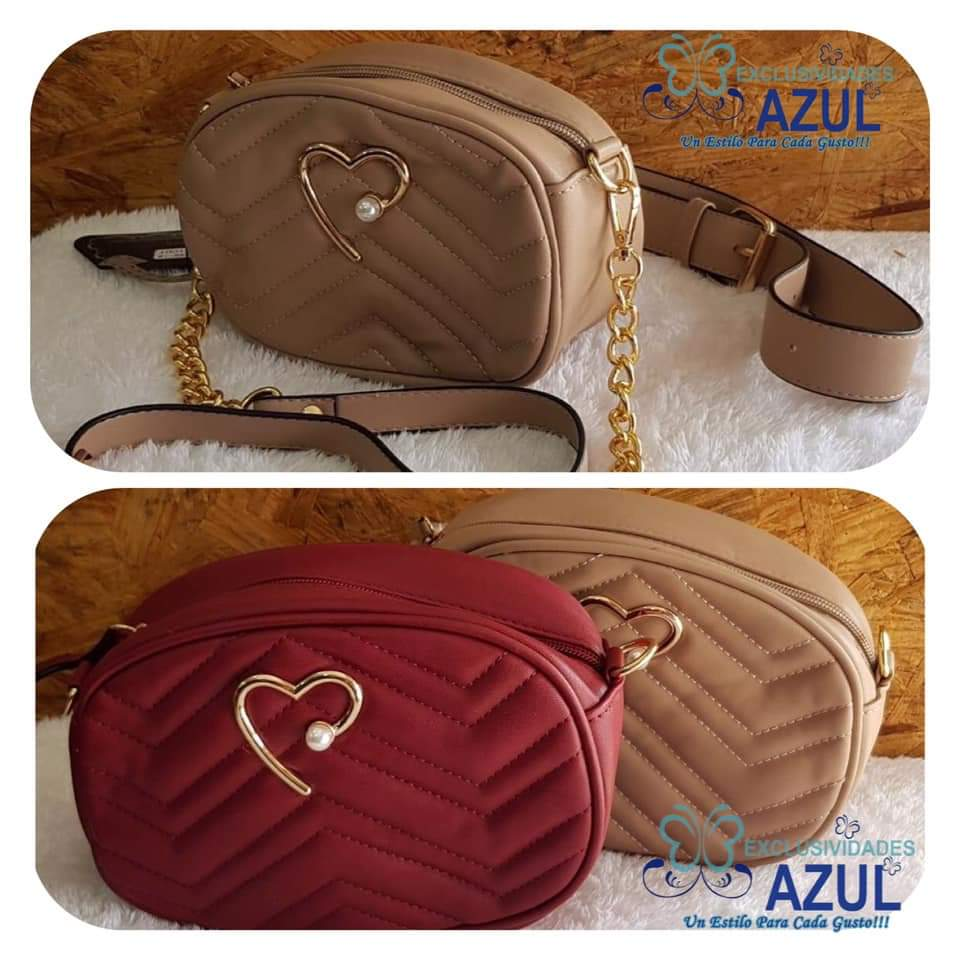
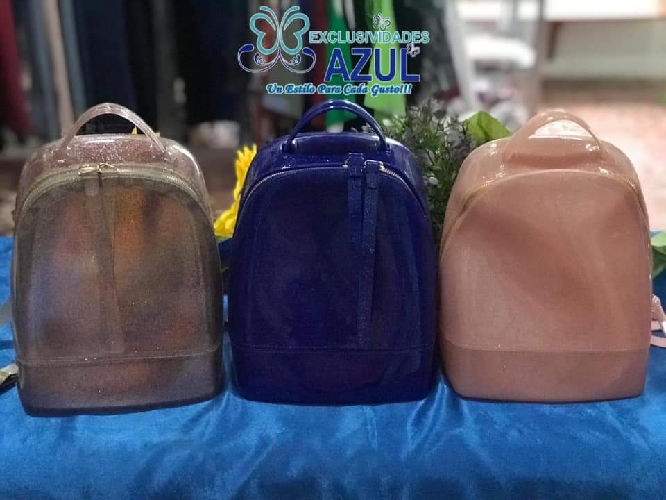

# Tienda Exclusividades Azul
Manual de usuario 

## Autor 

* Isabely Consuelo Téllez Aragón 


## Tecnologías 

* CSS
* JavaScrip
* HTML5
* Markdown

## Descripción 

El sitio web está conformado por un menu sencillo (Inicio, Acerca de, Actualizaciones, Contacto y Galería) que presenta al usuario las siguientes secciones principales de la página.


```html
<div class="navbar-fixed">
  <nav class="cyan">
    <div class="nav-wrapper">
      <div class="container">
        <a href="#" class="brand-logo">Inicio</a>
        <a href="#" data-activates="mobile-menu" class="button-collapse"><i class="material-icons">menu</i></a>
        <ul class="right hide-on-med-and-down">
          <li><a href="#">Acerca de</a></li>
          <li><a href="#">Actualizaciones</a></li>
          <li><a href="#">Contacto</a></li>
          <li><a href="#">Galería</a></li>
        </ul>
      </div>
    </div>
  </nav>
</div>
<ul class="side-nav" id="mobile-menu">
  <li><a href="#">Acerca de</a></li>
  <li><a href="#">Actualizaciones</a></li>
  <li><a href="#">Contacto</a></li>
  <li><a href="#">Galería</a></li>
</ul>
```
En la primera sección tenemos un slider con imágenes referentes a la tienda que representan el color azul, color que identifica a la tienda.
```html
<section>
  <div class="slider">
    <ul class="slides">
      <li>
         
        <div class="caption center-align">
          <h3>Exclusividades Azul</h3>
          <h5 class="light grey-text text-lighten-3">Un estilo para cada gusto</h5>
          <br>
          <a class="waves-effect waves-light btn indigo white-text" target="_blank" href="https://www.facebook.com/pg/ExclusividadesAzul/photos/?ref=page_internal">Ver info</a>
        </br>
        </div>
      </li>
      <li>
         
        <div class="caption left-align">
          <h3>Conoce nuestros productos</h3>
        </div>
      </li>
      <li>
         
        <div class="light black-text caption center-align">
          <h3>Encuentra lo que buscas</h3>
        </div>
      </li>
      <li>
         
        <div class="light black-text caption right-align">
          <h3>Tendencias de la moda</h3>
        </div>
      </li>
    </ul>
  </div>
  ```
  A continuación se muestra la segunda sección que es la barra de búsqueda  don el usuario puede buscar todo lo que la tienda ofrece: 
  * Ropa para damas, caballeros y niños
  * Accesorios 
  * Maquillaje
```html
</section>
<section class="buscar teal darken-1 white-text center"> 
  <div class="container">
    <div class="row">
      <div class="col s12">
        <h3> Buscar productos</h3>
        <div class="input-field">
          <input class="white grey-text autocomplete" placeholder="Ropa para damas, Ropa para caballeros, Ropa para niños, Accesorios, Maquillaje">
          </input>
        </div>
      </div>
    </div>
  </div>
</section>
```
En la tercera sección tenemos datos importantes de la tienda como lo es su ubicación, la descripcion de la tienda y los productos que esta ofrece.
```html
<section class="container">
   <div class="row center">
  <div class="col s12 m4">
    <i class="material-icons large blue-text">room</i>
    <h4>Ubicación</h4>
    <p>De Enitel 35 vrs al Sur, Juigalpa, Chontales.</p>
  </div>
  <div class="col s12 m4">
    <i class="material-icons large red-text">store</i>
    <h4>Tienda</h4>
    <p>Exclusividades Azul es una tienda de distintos accesorios con una amplia variedad para todas las edades.</p>
  </div>
  <div class="col s12 m4">
    <i class="material-icons large yellow-text">star</i>
    <h4>Producto</h4>
    <p>Ropa para damas, caballeros y niños, accesorios y maquillaje.</p>
  </div>
</div>
</section>
```
La cuarta sección muestra los productos que la tienda ofrece, cada producto con su descripción y una foto de estos y por último tenemos un pequeño botón donde pueden obtener los productos en un sistema de aparatado.
```html
<Section>
  <div class="container">
  <div class="row">
    <br> 
    <h4 class="center indigo-text">Productos</h4>
        <div class="col s12 m4">
      <div class="card">
        <div class="card-image">
          
          <span class="card-title">Ropa para damas, caballeros y niños</span>
        </div>
        <div class="card-content">
          <p>Ofrecemos algo novedoso como lo es la ropa de segunda mano, lavada y planchada, lista para el uso; y ropa nueva de marca y nacional para todas las edades. </p>
          </div>
        </div>
      </div>

      <div class="col s12 m4">
          <div class="card">
            <div class="card-image">
              
              <span class="card-title">Accesorios</span>
            </div>
            <div class="card-content">
              <p> Ofrecemos distintos accesorios como mochilas, accesorios para el cabello, bisutería, cojines, reloj, carteras, entre otras cosas.</p>
              </div>
            </div>
          </div>

          <div class="col s12 m4">
              <div class="card">
                <div class="card-image">
                  
                  <span class="card-title">Maquillaje</span>
                </div>
                <div class="card-content">
                  <p>Entre los accesorios de maquillaje les ofrecemos paletas, labiales, brochas, base, contorno, iluminadores, aguas miselar, etc.  </p>
                  </div>
                </div>
              </div>
            </div>
          </div>
          <div class="row">
              <div class="col s12 center">
                <a class="btn btn-large blue"><i class="material-icons left">send</i>Sistema de apartado</a>
              </div>
            </div>
</Section>
```
La quinta sección tenemos un pequeño botón donde la tienda da la opción al usuario para que estos sigan su tienda en las redes sociales.
```html
<Section class="indigo teal darken-1 white-text center síguenos">
  <div class="container">
    <div class="row">
      <div class="col s12">
        <h4>Síguenos en nuestras redes</h4>
        <p>Conoce nuestros servicios y las promociones que te ofrecemos</p>
      </div>
    </div> 
  </div>
</Section>
```
A continuación en la sexta sección tenemos la galería de fotos que muestra los productos que la tienda ofrece.
<section>
  <div class="container">
    <h4 class="center indigo-text">Galería de fotos</h4>
    <div class="row">
      <div class="col s12 m3">
        
        </div>
        <div class="col s12 m3">
            
            </div>
            <div class="col s12 m3">
                
                </div>
                <div class="col s12 m3">
                    
                    </div>
                    <div class="col s12 m3">
                        
                        </div>
                        <div class="col s12 m3">
                            
                            </div>
                            <div class="col s12 m3">
                                
                                </div>
                                <div class="col s12 m3">
                                    
                                    </div>
    </div>
  </div>
</section>

Para culminar tenemos la séptima y última sección donde encontramos el contacto de la tienda para que el usuario pueda consultar a la tienda lo que desee.

```html
<section>
  <form>
    <div class="container">
    <h4 class="center indigo-text">Contáctanos</h4>
      <div class="row">
      <form>
    <div class="input-field col s12 l6">
      <input type="text" id="primer_nombre" class="validate">
      <label for="primer_nombre">Primer Nombre</label>
    </div>
    <div class="input-field col s12 l6">
      <input type="text" id="segundo_nombre" class="validate">
      <label for="segundo_nombre">Segundo Nombre</label>
    </div>
    <div class="input-field col s12">
      <input type="email" id="email" class="validate">
      <label for="email" data-error="Correo Inválido" data-success="Correcto">Email</label>
    </div>
    <div class="input-field col s12">
      <textarea id="mensaje" class="materialize-textarea"></textarea>
      <label for="mensaje">Mensaje</label>
    </div>
    <button class="btn waves-effect waves-light blue" type="submit" name="action">Enviar
      <i class="material-icons right">send</i>
    </button>
  </form>
</section>
```
